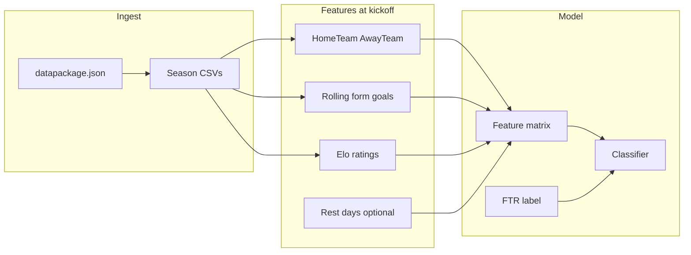

# EPL result prediction: step-by-step learning plan

## Context: what you are predicting

The [English Premier League dataset on DataHub](https://datahub.io/core/english-premier-league) exposes one CSV per season (for example `season-2425.csv`) with match rows. The natural supervised target for “who wins?” is **`FTR`** (H = home win, D = draw, A = away win). Goals **`FTHG` / `FTAG`** are optional regression or auxiliary targets later.

Stable file access is documented on the dataset page: read **`datapackage.json`** first (it lists every CSV URL), then download resources. Note: many docs list URLs under `https://datahub.io/football/english-premier-league/_r/-/...`; if your bookmark is `/core/...`, use the **`datapackage.json` link shown on that same page** so URLs stay correct.

**Era limitations (important for features):**

- **1993/94–1994/95:** final scores only  
- **1995/96–1999/00:** adds half-time scores  
- **2000/01 onward:** referee + shots/fouls/corners/cards  

For a first model, restrict to **2000/01+** (or drop sparse columns until 2000/01) so you have a consistent feature set.

---

## Phase 0: environment and habits

1. Create a virtual environment (e.g. `python -m venv .venv`) and activate it.  
2. Install a minimal stack: **`pandas`**, **`numpy`**, **`scikit-learn`**, **`requests`** (or use **`frictionless`** / raw `urllib` if you prefer). Optional later: **`matplotlib`**, **`seaborn`** for plots; **`xgboost`** or **`lightgbm`** when you outgrow linear models.  
3. Pin versions in **`requirements.txt`** once things run.

**Learning goal:** reproducible installs and a single command to re-run training.

---

## Phase 1: load and understand the data

1. **Fetch metadata:** `GET` `datapackage.json`, parse JSON, list `resources` and their `path` or URLs.  
2. **Load all seasons** into one `pandas.DataFrame`, add a **`season`** column (derive from filename or resource name).  
3. **Parse `Date`** as datetime; sort globally by `Date` (and optionally kickoff order within a day if you add it later).  
4. **EDA (exploratory data analysis):**  
   - Class balance of `FTR` (home wins dominate in the EPL—your baseline will reflect this).  
   - Missingness by column and by season (older seasons lack stats).  
   - Simple sanity plots: goals per season, home vs away win rates.

**Learning goal:** tabular data workflows, missing data, and domain base rates.

---

## Phase 2: define the ML problem cleanly

1. **Primary task:** **3-class classification** → predict `FTR` from **information available before kickoff**.  
2. **Secondary (later):** predict **`FTHG`/`FTAG`** (regression) or goal difference; harder and needs different metrics.

**Learning goal:** supervised learning = features `X` + label `y`, with a fixed prediction horizon.

---

## Phase 3: avoid leakage (the most important lesson)

**Leakage rule:** anything recorded **during or after** the match must **not** be in `X` for predicting `FTR`.

- **Forbidden as inputs** for pre-match prediction: `FTHG`, `FTAG`, `HTHG`, `HTAG`, `HTR`, half-time/full-time result fields, in-match stats (`HS`, `AS`, `HST`, …), cards, corners, referee (unless you justify pre-known assignments—usually skip).  
- **Allowed:** team identities, date/season, **historical** summaries computed using **only prior matches** for each team.

**Learning goal:** if accuracy looks “too good,” you probably leaked post-match information into features.

---

## Phase 4: time-aware dataset construction

1. **Chronological split:** e.g. train on seasons **≤ 2019/20**, validate on **2020/21–2022/23**, test on **2023/24+**. Adjust cutoffs to taste; the key is **never train on future matches when fitting scalers or computing rolling stats**.  
2. **Per-row feature computation:** for each match row, update team statistics using **past** rows only (rolling windows, expanding averages, or Elo updated after each past result). Implement with explicit loops first for clarity, then optimize if needed.  
3. **Encoding teams:** start with **`OneHotEncoder`** / sparse features for `HomeTeam` and `AwayTeam` (high dimension but educational), or target encoding **only if** fit statistics are computed inside training folds (advanced—skip initially).

**Learning goal:** why random `train_test_split` on shuffled rows cheats in sports forecasting.

---

## Phase 5: feature engineering (start simple, then deepen)

**Version A (minimal, educational):**

- Home indicator is implicit in structure; still useful to add **`is_home`** for away perspective if you redesign rows.  
- **Rolling goals for/against** over last N matches (separate home and away tracks to respect venue effects).  
- **Elo-style rating** (implement a tiny Elo update after each match when building the dataset row-by-row—classic teaching exercise).

**Version B (after A works):**

- Days since last match (fatigue), league position proxy from points tally so far (computed from prior results only).

**Learning goal:** creativity within constraints; signal vs noise.

---

## Phase 6: baselines before “real” ML

1. **Majority class baseline:** always predict the most common `FTR` in the training window.  
2. **Home-always baseline:** always predict `H` (often surprisingly competitive in the EPL).  
3. **Sklearn `DummyClassifier`** with `strategy='most_frequent'` to match (1).

**Learning goal:** your model must beat trivial rules, or you have not learned anything yet.

---

## Phase 7: models (progression matches pedagogy)

1. **`LogisticRegression(multi_class='multinomial')`** with `StandardScaler` in a **`Pipeline`**—interpretable coefficients, fast.  
2. **`RandomForestClassifier`** or **`HistGradientBoostingClassifier`**—nonlinearities, interaction-ish behavior without hand-crafting.  
3. Optional: **`xgboost.XGBClassifier`** with `objective='multi:softprob'` once metrics are stable.

**Learning goal:** pipelines, hyperparameters, and overfitting checks on the validation slice.

---

## Phase 8: evaluation that fits imbalanced 3-way outcomes

1. **Metrics:** **accuracy** (easy but misleading), **log loss** (if you output probabilities with `predict_proba`), **macro-F1** (treats H/D/A equally—draws are hard).  
2. **Confusion matrix** on the test window; inspect where draws are confused with wins.  
3. **Calibration (optional):** reliability curves for predicted win probabilities.

**Learning goal:** choosing metrics aligned with the business/educational question (here: probability quality vs raw accuracy).

---

## Phase 9: project structure (suggested layout for your repo)

When you implement in [`/Users/wojciechcharuza/Documents/epl-predictor`](/Users/wojciechcharuza/Documents/epl-predictor), keep scripts small and composable:

- `src/download.py` — fetch `datapackage.json` + CSVs to `data/raw/`  
- `src/dataset.py` — merge seasons, clean types, filter 2000/01+  
- `src/features.py` — rolling / Elo features without leakage  
- `src/train.py` — split, pipeline, fit, save model with `joblib`  
- `src/evaluate.py` — metrics + confusion matrix on held-out seasons  
- `notebooks/01_eda.ipynb` (optional) — plots only; keep training in scripts for repeatability

**Learning goal:** separation of concerns mirrors real ML projects.

---

## Phase 10: stretch goals (after one full pass)

- **Walk-forward validation:** slide the training window season-by-season.  
- **Hierarchical / Bayesian** models (PyMC) for uncertainty—advanced but insightful.  
- **Poisson / Dixon–Coles** statistical models as a classical sports baseline.  
- **Fair comparison:** if you ever add bookmaker odds from another source, compare log loss to the market—not required for DataHub-only learning.

---

## Realistic expectations

Match outcomes are **low signal-to-noise**. A modest accuracy lift over “always home” or macro-F1 above naive baselines is a **success** for learning. The value is mastering **data hygiene, temporal splits, and honest evaluation**—skills that transfer far beyond football.
